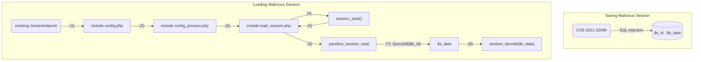
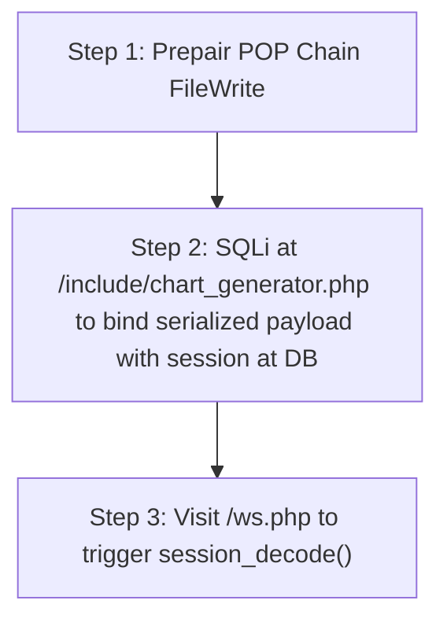

# CVE-2021-32098

## Table of Contents

- [1. Description](#1-description)
- [2. From SQLi (CVE-2021-32099) to PHP deserialization](#2-from-sqli-cve-2021-32099-to-php-deserialization)
    - [2.1. CVE-2021-32099: Can we go further after SQL Injection successfully?](#21-cve-2021-32099-can-we-go-further-after-sql-injection-successfully)
    - [2.2. PHP deserialization via `session_decode()`](#22-php-deserialization-via-session_decode)
    - [2.3. Finding Useful Gadget Chains](#23-finding-useful-gadget-chains)
        - [2.3.1. How can we trigger session_decode()?](#231-how-can-we-trigger-session_decode)
        - [2.3.2. SwiftMailer POP Chains](#232-swiftmailer-pop-chains)
    - [2.4. Final Exploit Plan](#24-final-exploit-plan)
    
## 1. Description

Artica Pandora FMS 742 allows unauthenticated attackers to perform Phar deserialization.

## 2. From SQLi (CVE-2021-32099) to PHP deserialization

### 2.1. CVE-2021-32099: Can we go further after SQL Injection successfully?

Reminding a little bit about the SQL Injection vulnerability from [CVE-2021-32099](/cve-2021-32099/) that allows an unauthenticated user to inject an `id_session` payload stored inside the database

<p align='center'></p>

In the previous analysis, we only stopped at creating a valid `id_session` to gain admin privileges. Now, let's think about a further attack vector:

<p align='center'></p>

### 2.2. PHP deserialization via `session_decode()`

From [PHP Manual](https://www.php.net/manual/en/function.session-decode.php):

> [!NOTE]  
> In PHP, `session_decode($data)` decodes the serialized session data provided in $data, and populates the `$_SESSION` superglobal with the result.

By default, the unserialization method used is internal to PHP, and is **NOT THE SAME AS** [`unserialize()`](https://www.php.net/manual/en/function.unserialize.php). The serialization method can be set using [`session.serialize_handler`](https://www.php.net/manual/en/session.configuration.php#ini.session.serialize-handler). Below is some comparisons:

- Example class:

    ```php
    // test.php
    class User {
        private $username;
        private $email;

        public function __construct($name, $mail) {
            $this->username = $name;
            $this->email    = $mail;
        }
    }
    $obj = new User('vnc', 'vnc@gmail.com');
    $_SESSION['some_key'] = $obj;
    ```
- `serialize` vs `session_encode`:

    ```bash
    [+] serialize($obj)  = O:4:"User":2:{s:14:".User.username";s:3:"vnc";s:11:".User.email";s:13:"vnc@gmail.com";}
    [+] session_encode() = some_key|O:4:"User":2:{s:14:".User.username";s:3:"vnc";s:11:".User.email";s:13:"vnc@gmail.com";}
    ```
- `unserialize` vs `session_decode`:

    <p align='center'></p>

### 2.3. Finding Useful Gadget Chains

We've discovered a potential attack vector that exploits PHP deserialization via the `session_decode('<malicious_input>')` function (the `<malicious_input>` can be manipulated through the previous existing SQLi vulnerability). 

The two crucial factors required to exploit PHP deserialization vulnerabilities are:

1. **The entrypoint:** 
    - `session_decode('<malicious_input>')`
    - `unserialize('<malicious_input>')`
2. **The context in which we perform deserialization:** The `<malicious_input>` must contains all classes defined in the same context as the deserialization trigger. That could be:
    - `class` is defined as the same place where `session_decode` is called.
    - `class` is included by using: `require`, `include`.

#### 2.3.1. How can we trigger `session_decode()`?

Let's see how PandoraFMS manage its session handlers by checking **/include/load_session.php**:

```php
    [...]
    function pandora_session_read($session_id) {
        $session_id = addslashes($session_id);
        $session_data = db_get_value(
            'data',
            'tsessions_php',
            'id_session',
            $session_id
        );

        if (!empty($session_data)) {
            return $session_data;
        } else {
            return '';
        }
    }

    [...]
    // TODO: SAML should work with pandora session handlers.
    if (db_get_value('value', 'tconfig', 'token', 'auth') != 'saml') {
        $result_handler = session_set_save_handler(
            $open   = 'pandora_session_open'    ,
            $close  = 'pandora_session_close'   ,
            $read   = 'pandora_session_read'    ,
            $write  = 'pandora_session_write'   ,
            $destroy= 'pandora_session_destroy' ,
            $gc     = 'pandora_session_gc'
        );
    }
```

According to [PHP Manual](https://www.php.net/manual/en/function.session-set-save-handler.php):

> [!NOTE]  
> The value `read` callback returns must be in exactly the same serialized format that was originally passed for storage to the `write` callback. 
>
> The value returned will be unserialized automatically by calling PHP `session_decode()` and used to populate the `$_SESSION` superglobal

So here is the flow that we can trigger `session_decode(<malicious_payload>)` whenever visiting any page on Pandora:



#### 2.3.2. SwiftMailer POP Chains

After reviewing the source code for a period of time, I discovered that Pandora uses a third-party library called [SwiftMailer-v6.1.3](https://swiftmailer.symfony.com/docs/introduction.html).

<p align='center'></p>

To use those third-party libraries (packages inside `vendor` folder) we need a concept called [Autoloading Classes](https://www.php.net/manual/en/language.oop5.autoload.php). In this case, it use [composer](https://getcomposer.org/) to manage third-party installation, there is a file called `/vendor/autoload.php` which is responsible for autoloading classes when they are used. So to check which place loading SwiftMailer, we search for which file have included `autoload.php`, like this:

<p align='center'></p>

So we know that there is some places that uses SwiftMailer, now we need to find some interesting gadgets. SwiftMailer is a popular library that exists many POP Chains like File Delete, File Read, File Write. Here are more information about these pop chains:

- [phpmailer + swiftmailer 0day unserialize RCE](https://github.com/CFandR-github/advisory/blob/main/phpmailer_rce_poi/phpmailer_unserialize_rce_0day.md)
- [PHPGGC: SwiftMailer gadget chains](https://github.com/ambionics/phpggc/tree/master/gadgetchains/SwiftMailer)

For this senario, I will use File Write chains for uploading webshell to remote location:

- Gadgets:

    ```php
    class Swift_ByteStream_FileByteStream extends Swift_ByteStream_AbstractFilterableInputStream{}

    class Swift_Events_SimpleEventDispatcher{}
    
    class Swift_Transport_SendmailTransport {
        public $buffer;
        public $started;
        public $eventDispatcher;
    }

    abstract class Swift_ByteStream_AbstractFilterableInputStream {
        private $filters = [];
        private $writeBuffer = '<?php phpinfo();?>//';
    }
    ```

- Abstract views:

    ```mermaid
    classDiagram
    class Swift_Transport_SendmailTransport{
        +$buffer
        +$started: true
        +$eventDispatcher
        +__destruct(): this->stop()
        +stop()
        +executeCommand(): this->buffer->write($command)
    }

    class Swift_ByteStream_FileByteStream{
        -$path: "path/to/file"
        -$mode
        +write()
        +doWrite()
    }

    class Swift_Events_SimpleEventDispatcher{
        +createTransportChangeEvent()
        +dispatchEvent()
    }
    
    class Swift_ByteStream_AbstractFilterableInputStream{
        $filters
        $writeBuffer: "payload_write_to_path"
    }

    Swift_Transport_SendmailTransport --|> Swift_Events_SimpleEventDispatcher: $eventDispatcher
    Swift_Transport_SendmailTransport --|> Swift_ByteStream_FileByteStream: $buffer
    Swift_ByteStream_FileByteStream --|> Swift_ByteStream_AbstractFilterableInputStream: $writeBuffer
    
    ```

- Flow when trigger POP chain by triggering `Swift_Transport_SendmailTransport->__destruct()`

    ```mermaid
    flowchart TD
        A["Swift_Transport_SendmailTransport.__destruct()"] -- (1) --> B["Swift_Transport_SendmailTransport.stop()"]
        B -- (2) --> C["Swift_Transport_SendmailTransport.executeCommand()"]
        C -- (3) --> D["Swift_ByteStream_FileByteStream.write()"]
        D -- (4) --> E["Swift_ByteStream_FileByteStream.doWrite()"]
        E -- (5) --> F["fwrite(Swift_ByteStream_FileByteStream.getWriteHandle, Swift_ByteStream_FileByteStream.writeBuffer)"]
    ```

### 2.4. Final Exploit Plan

