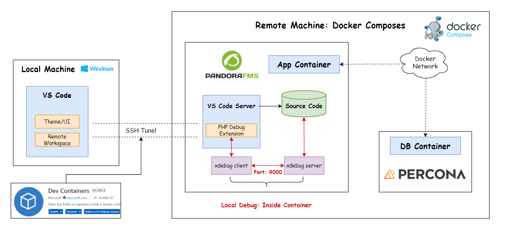
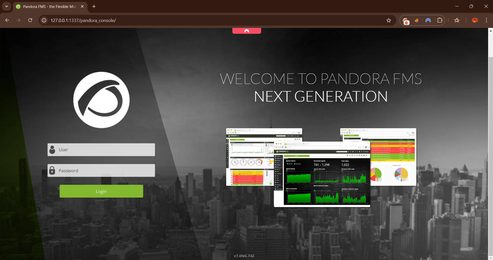
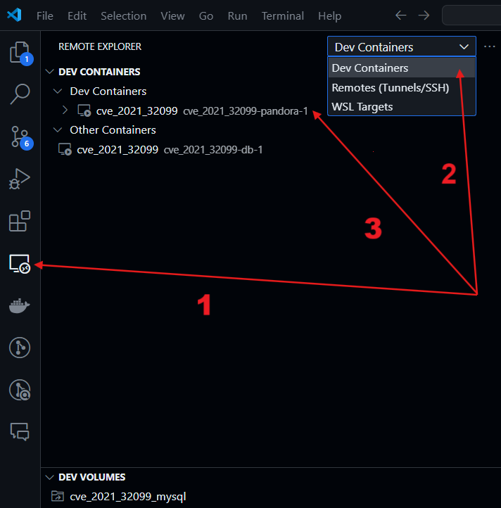
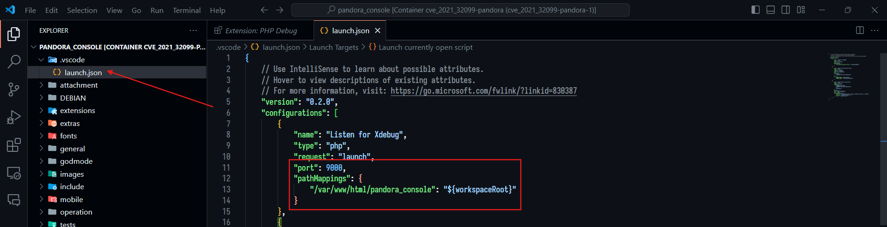
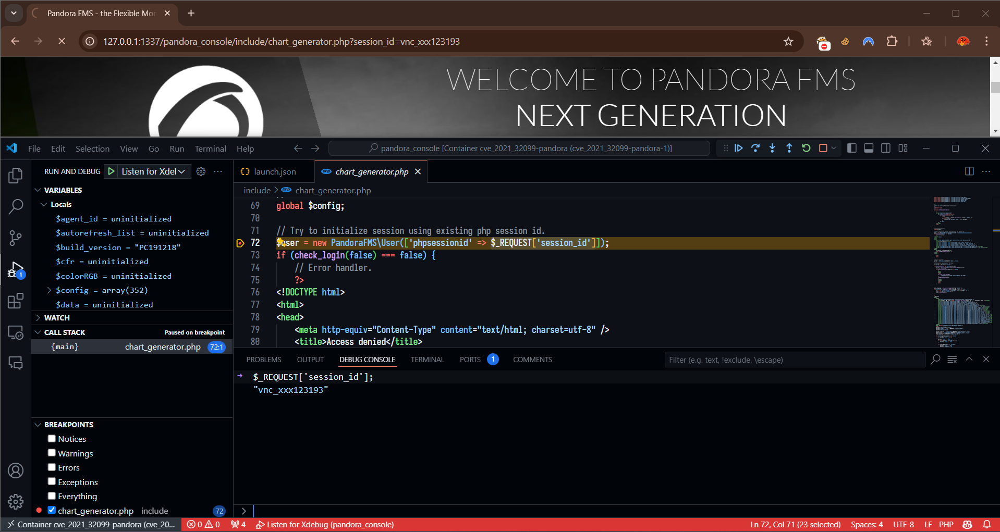

# PandoraFMS v742

This folder contains all the necessary files to setup and debug [PandoraFMS-v742](https://pandorafms.com/en/).

## Environment Information

<p align="center">  </p>

**Files Overview:**

- PandoraFMS v742 env:
    - [Dockerfile](./Dockerfile): PandoraFMS v742 docker images
    - [docker-compose.yml](./docker-compose.yml): Docker compose environment with two main components (**percona** and **pandora**)
- PHP debug env:
    - [20-xdebug.ini](./20-xdebug.ini): [xdebug](https://xdebug.org/) configuration file for debug php-7.2.
- Others:
    - [Makefile](./Makefile): just for quick launching docker (`make up`, `make down`, `make build`)
    - [launch.json](./.vscode/launch.json): xdebug configuration file.

**Other Prerequisites:**

- [Docker](https://www.docker.com/)
- [Visual Studio Code](https://code.visualstudio.com/) with some plugins:
    - [Remote Explorer](https://marketplace.visualstudio.com/items?itemName=ms-vscode.remote-explorer): View remote machines for SSH and Tunnels. Just easy way to find and access remote containers.
    - [Docker](https://marketplace.visualstudio.com/items?itemName=ms-azuretools.vscode-docker): The Docker extension makes it easy to build, manage, and deploy containerized applications from Visual Studio Code. 
    - [Dev Containers](https://marketplace.visualstudio.com/items?itemName=ms-vscode-remote.remote-containers): Open any folder or repository inside a Docker container and take advantage of Visual Studio Code's full feature set.
    - [PHP Debug](https://marketplace.visualstudio.com/items?itemName=xdebug.php-debug): Debug support for PHP with Xdebug.

## Getting Started

**Running PandoraFMS-v742 Containers**

- Pull/Build all docker images then up all containers:
    ```bash
    $ make up
    ```
- You can check the status of all containers by using this command:
    ```bash
    $ docker ps -a
    CONTAINER ID   IMAGE                                 COMMAND                  CREATED          STATUS          PORTS                                                                           NAMES
    d8793f542470   cve_2021_32099-pandora                "/bin/sh -c 'sh /tmp…"   26 minutes ago   Up 26 minutes   0.0.0.0:162->162/udp, 443/tcp, 0.0.0.0:41121->41121/tcp, 0.0.0.0:1337->80/tcp   cve_2021_32099-pandora-1
    385a4300ce4e   rameijeiras/pandorafms-percona-base   "/docker-entrypoint.…"   26 minutes ago   Up 26 minutes   3306/tcp                                                                        cve_2021_32099-db-1
    ```
- Access pandora console at: http://127.0.0.1:1337/pandora_console/ with default credential is `admin:pandora`
    <p align="center">  </p>

**Debug PHP inside containers with VSCode and xdebug**

- Open VSCode, click on Remote Explorer tab, switch to Dev Containers and find `cve_2021_32099-pandora-1` container:
    <p align="center">  </p>
- Make sure that PHP Debug is already installed on remote container. Then we add debug configuration by clicking `Run > Add Configuration... > PHP`. This will create default `.vscode/launch.json` file, change `port` to `9000` and add `pathMappings` config field likes this:
    <p align="center">  </p>
- Everything is done. Now set some breakpoints, press `F5`, back to browser and do some browsing, back to vscode and check some debugging status:
    <p align="center">  </p>